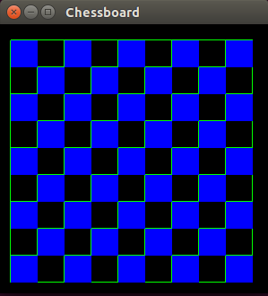
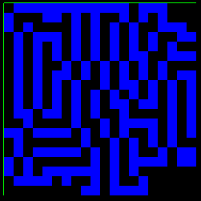
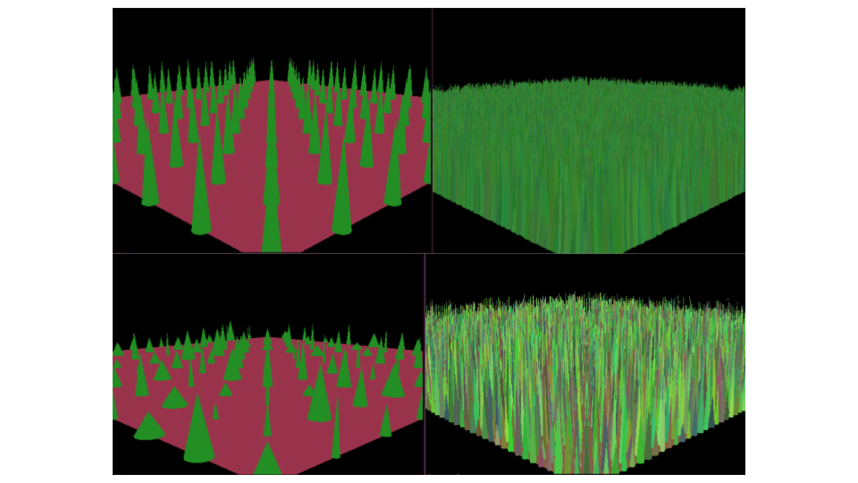

# Graphical Grapes Preliminary Report

## Project Goals

**Overview**

Our goals for this project are focused around generating graphics procedurally.  We will learn to use OpenGL in conjunction with C to generate graphics and explore a variety of current procedural modeling methods.  We will also explore the integration of Cellular Automata as another method to generate patterns.

**MVP**

Our MVP implementation is an endless maze that is continuously generated following a set of predetermined algorithms.  Maze characteristics will include cellular automata behaviors that define how the new blocks are generated at each step and allowing users to traverse the maze.

**Stretch Goals**

Our stretch goals include generating grass terrain for the maze to explore more advanced procedural algorithms, adding complex player mechanics such as breaking down maze walls, and improving the graphics performance.

## Completed Trello Cards

https://trello.com/c/MwVXhCLo - See User Motion section and [this.](https://youtu.be/O32-wlqlD8Q)

https://trello.com/c/pi9P70Lp - I did some simple research on known CA rules which might apply for our project. In exploring, I found an app which allows you to play with CA’s and different rules on your phone. One of their pre-set CA’s was titled “Maze”. Bill tested the settings within our own CA and it appears to make reliable mazes which grow outwards.

https://trello.com/c/RYDslPuf and https://trello.com/c/nKHc81te - See the chessboard and maze_procedural_2d directories for grid apis created.  This allows easy drawing moving forward.  See the chessboard and maze_procedural_2d directories for demo grid drawing code

https://trello.com/c/tHlTqHKY - See the user_motion directory for the simple WASD implementation.  This is expanded to more advanced motion in Ted’s maze directory

https://trello.com/c/cmdSz1Lq - See the grass directory and the procedural terrain section below.  To complete this implementation, I wrote a version of a linked list that stores arrays as well as a drawing API that provides the grass generation interface.

https://trello.com/c/wi1Q7THP - Research area that led to the 2D maze implementation

https://trello.com/c/BojQET9k - See the cellular directory and the cellular automata maze applications section below.  Wrote a CA implementation that results in a valid 2D maze.

https://trello.com/c/eBTakn1o - Eller’s algorithm as specified below

Project admin and research cards were completed by all team members and can be found on our [board](https://trello.com/b/UZL4Y39R/softsysgraphicalgrapes).  This resulted in both reports as well as research, design decisions, and the resources section below.

## Preliminary Results

We focused this sprint on creating individual building blocks that are all necessary components of our maze.  This allowed each of us to focus on different areas of graphics, procedural algorithms, and cellular automata.

**OpenGL Basics**

We began by creating a simple 2D grid drawing API that allows us to draw a grid and fill in specified tiles.  This provides capabilities for drawing 2D mazes.  Moving forward, we are able to draw and move among 3D cubes that will make up the walls of our first person maze game as specified below. 



**User motion**
Since we want our player to be able to navigate the maze in 3D space, we need to map the OpenGL camera onto the “eye” of our player. 

Our framework is setup such that any object that is drawn has values to represent its position, velocity, and acceleration in all 3 dimensions. This is an advantage when making a game such as this as it will add more realistic motion - it will take time to reach top walking speed and time to slow down. Furthermore, storing these values allows the user to use multiple commands at once. The simplest example would be a user pressing ‘w’ and ‘a’ at the same time with the intention of walking forward-left. It would also be useful if we implement a simple ‘jump’ as the player would continue their momentum even in the jump.

Although the program is currently able to take the momentum from the last frame into account, at the moment the built-in keyboard input function we are using( glutKeyboardFunc() and glutSpecialFunc()) are unable to handle 2 pieces of input at once. So we may want to expand on that and create our own idle listening function which creates a new thread on every keystroke which would terminate once the command to move the player or rotate the command is executed.

At the moment the player can use the WASD keys to move forward, backwards, strafe left and right, and can use the left and right arrow keys to rotate the camera.

[Click here to see a video of some simple user motion](https://youtu.be/O32-wlqlD8Q)


**Cellular Automata Maze Applications**

We implemented a cellular automata maze generator in OpenGL.  It starts with a hardcoded initial state, but could be expanded to random initial states.  




These pictures are an example of a simple 20x20 grid maze generated with our cellular automata rules.  The rules it uses are a cell survives if is has 1-5 neighbors, and creates if it has 3 neighbors.  This algorithm will need to be updated to make sure each maze has one path that leads to an exit.

We also did research on different procedural maze generation algorithms. Eller’s Algorithm is one of the few that allow infinite maze generation and it generates a new row of the maze only based on the previous one.

```
  ___________________
  |           |       |
  |           |       |
  |    ___    |___    |
  |       |       |   |
  |       |       |   |
  |___    |_______|   |
  |   |   |           |
  |   |   |           |
  |   |   |___     ___|
  |                   |
  |                   |
  |___________________|
```

### Procedural Terrain Generation

To explore other aspects of advanced procedural graphics generation algorithms, we have also implemented a basic grass terrain generator, which we will integrate into the final maze borders for texture.

Each blade is drawn individually following an algorithm that is given ranges and variation values for grass height, width, color, and location.  The border values of the ranges are cut at certain percentiles based on the variation parameters to allow a wide variety of appearances with only four input values.  

Moving forward, we will also add sparseness and bend to make the scene more realistic in the spirit of Pixar’s “wondergrass” algorithms.



### Integration Plan

The components described above provide the building blocks that we need to create the full maze application in the second sprint.

## Resources

**OpenGL Resources**

An overview of the OpenGL pipeline and some of the available capabilities involved.

[Getting Started with OpenGL](http://duriansoftware.com/joe/An-intro-to-modern-OpenGL.-Table-of-Contents.html)

A tutorial on how to build an OpenGL application in the C programming language.

[Building OpenGL Applications in C](http://www.opengl-tutorial.org/miscellaneous/building-your-own-c-application/)

A tutorial on rendering 3D text in OpenGL.

[Rendering 3D Objects in OpenGL](https://www.toptal.com/opengl/introduction-to-opengl-a-quick-tutorial)

A set of lecture notes that describes how a variety of shapes and patterns can be created.

**Procedural Generation Resources**

[Princeton Lecture on Procedural Modeling](http://www.cs.princeton.edu/courses/archive/spr03/cs426/lectures/16-procedural.pdf)

This paper provides a general overview of procedural modeling capabilities.

[Cellular Automata library](http://kidojo.com/cellauto/)

A C library for generating cellular automata, useful to look at code to see how cellular automata work.

[Procedural Generation tutorials for Unity](http://catlikecoding.com/unity/tutorials/)

Tutorials for procedural generation in Unity for everything from fractal generation to complex procedural meshes and textures.

[A General Procedural Modeling Algorithm](http://graphics.stanford.edu/~pmerrell/tvcg.pdf)

Shows how simple procedural algorithms can be used in conjunction with area guides to create complex scenes.

[Guided Procedural Modeling](http://hpcg.purdue.edu/bbenes/papers/Benes11EG.pdf)

A paper on generating complex terrain.  This is too complex for the scope of our project, but an interesting look at the possibilities of the field.

[Artistic Rendering of Mountainous Terrain](http://www.cs.utah.edu/~bratkova/research/projects/panorama/togFinal2.pdf)

## Project Backlog

Our project backlog can be seen on our team Trello board [here](https://trello.com/b/UZL4Y39R/softsysgraphicalgrapes).

## Potential Roadblocks

We have each been building our OpenGL knowledge in order to be competent in every aspect of the project that will be integrated.  The building blocks that we have created so far have been successful, and the major roadblocks have been related to learning background concepts such as viewing in OpenGL.  Moving forward, the main difficulty will be integrating all of the components in a cohesive way, but good documentation and team communication, it should be straightforward to ensure that creating the final application goes smoothly.

